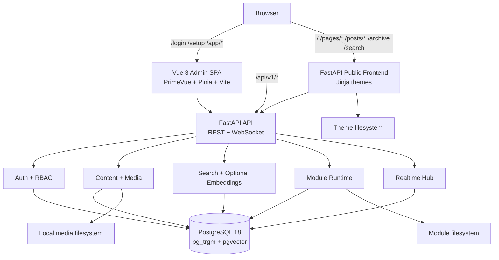
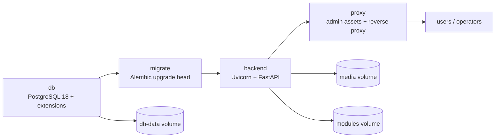

<h1 align="center">Pragma</h1>

<p align="center">
  <strong>A PostgreSQL-native CMS for single-site teams that want a serious backend, a modern admin, and server-rendered public pages.</strong>
</p>

<p align="center">
  <a href="docs/installation.md"></a>
  <a href="docs/deployment.md"></a>
  <a href="docs/architecture.md"></a>
  <a href="admin/package.json"></a>
  <a href="LICENSE"></a>
</p>

<p align="center">
  <code>FastAPI</code> · <code>Vue 3</code> · <code>PrimeVue</code> · <code>PostgreSQL 18</code> · <code>pg_trgm</code> · <code>pgvector</code> · <code>Jinja2</code> · <code>HTMX-ready themes</code>
</p>

---

## The short version

Pragma is a **single-site, multi-user content management system** built around PostgreSQL instead of an ORM abstraction layer. It ships with:

- a Python 3.12 / FastAPI backend with REST APIs under `/api/v1`;
- a Vue 3 + PrimeVue admin SPA for setup, content, media, users, AI settings, and account flows;
- a backend-rendered public frontend using filesystem themes and Jinja templates;
- PostgreSQL-native keyword, fuzzy, and optional vector/semantic search;
- a production Docker stack with PostgreSQL, migrations, backend, admin/proxy, media, and modules volumes.

It is designed to be explicit: infrastructure belongs in env/config and operator setup; application onboarding belongs in the setup wizard.

---

## What you get

| Area | Implemented capability |
| --- | --- |
| **Backend** | FastAPI app factory, structured errors, health/readiness, install detection, Alembic migrations |
| **Auth** | JWT bearer access tokens, HTTP-only refresh cookie, first-admin bootstrap, roles and permissions |
| **Content** | Content types, entries, publishing state, backend query modules, public page/post/archive routes |
| **Media** | Local filesystem image library for JPEG, PNG, GIF, and WebP uploads |
| **Search** | Keyword/fuzzy PostgreSQL search plus optional semantic/vector behavior when embeddings are configured |
| **Admin** | Vue 3 SPA with PrimeVue, Pinia, router guards, setup/content/media/AI/users/account surfaces |
| **Public frontend** | Server-rendered Jinja theme routes for home, pages, posts, archive, search, static theme assets, and themed 404s |
| **Themes** | Filesystem-discovered themes with a complete checked-in default theme |
| **Modules** | Filesystem-discovered backend modules with permission-gated APIs and isolated hook failures |
| **Realtime** | Admin-facing ticketed WebSockets backed by PostgreSQL LISTEN/NOTIFY |
| **Deployment** | Production Compose stack: `db -> migrate -> backend -> proxy` |

---

## Architecture at a glance



The backend uses raw SQL through `backend/src/pragma/storage/queries/`. No ORM. No alternate database backend. PostgreSQL 18 with `pg_trgm` and `vector`/pgvector is the supported database contract.

---

## Repository map

```text
pragma/
├── backend/          FastAPI backend, Alembic migrations, backend tests, package README
├── admin/            Vue 3 admin SPA, Vite config, Vitest tests
├── docker/           Development DB compose, production compose, images, proxy, validation
├── themes/default/   Checked-in public theme templates and static assets
├── docs/             Installation, deployment, architecture, config, testing, troubleshooting
└── scripts/          Backend test wrapper and pre-commit validation helpers
```

---

## Pick your path

| Path | Best for | What starts |
| --- | --- | --- |
| **Docker-backed development DB** | local development | PostgreSQL only; backend/admin run on your host |
| **Manual non-Docker install** | bare-metal or custom infra | your PostgreSQL, your process manager, your proxy |
| **Production Docker Compose** | full packaged deployment | PostgreSQL, migrations, backend, admin/proxy |

> The development Compose file is intentionally **not** a full application stack. It starts PostgreSQL only.

---

## Quick start: Docker-backed development database

Start a local PostgreSQL 18 database with the required extensions available:

```bash
docker compose -f docker/docker-compose.dev.yml --env-file docker/dev.env.example up -d
docker compose -f docker/docker-compose.dev.yml --env-file docker/dev.env.example ps
```

Create backend runtime configuration:

```bash
cp backend/.env.example backend/.env
```

Install backend dependencies and apply migrations:

```bash
cd backend
uv sync --dev
set -a && . ./.env && set +a
uv run alembic upgrade head
```

Run the backend:

```bash
cd backend
set -a && . ./.env && set +a
uv run uvicorn pragma.app:create_app --factory --host 127.0.0.1 --port 8000 --proxy-headers
```

In another shell, install and run the admin SPA:

```bash
cd admin
npm ci
VITE_BACKEND_PROXY_TARGET=http://127.0.0.1:8000 npm run dev
```

Then open the admin app and complete the [setup wizard](docs/setup-wizard.md). The wizard creates the first administrator; it does not provision PostgreSQL or run migrations.

See the full guide: [Installation](docs/installation.md) and [Development](docs/development.md).

---

## Manual non-Docker installation

Use this path when you provide PostgreSQL, process supervision, TLS, and reverse proxying yourself.

1. Install Python 3.12, `uv`, Node.js/npm, and PostgreSQL 18.
2. Install/enable required database extensions in the Pragma database:

   ```sql
   CREATE EXTENSION IF NOT EXISTS pg_trgm;
   CREATE EXTENSION IF NOT EXISTS vector;
   ```

3. Copy and edit backend runtime config:

   ```bash
   cp backend/.env.example backend/.env
   ```

4. Install dependencies, run migrations, and start the backend:

   ```bash
   cd backend
   uv sync --dev
   set -a && . ./.env && set +a
   uv run alembic upgrade head
   uv run uvicorn pragma.app:create_app --factory --host 127.0.0.1 --port 8000 --proxy-headers
   ```

5. Build the admin SPA:

   ```bash
   cd admin
   npm ci
   npm run build
   ```

6. Configure your reverse proxy so that:
   - `/api/v1` and `/api/v1/realtime/stream` go to the backend;
   - admin SPA routes such as `/login`, `/setup`, and `/app/*` serve `admin/dist`;
   - public `/`, `/pages/*`, `/posts/*`, `/archive`, and `/search` go to the backend-rendered public frontend.

Detailed notes: [Installation](docs/installation.md#manual-non-docker-path) and [Deployment](docs/deployment.md#non-docker-deployment-notes).

---

## Production Docker deployment

The production Compose path builds the full stack:



Prepare production env:

```bash
cp docker/prod.env.example docker/prod.env
```

Edit `docker/prod.env` for your deployment: database credentials, JWT secret, `PRAGMA_BASE_URL`, published ports, proxy settings, and secret handling.

Start the stack:

```bash
docker compose -f docker/docker-compose.yml --env-file docker/prod.env up -d --build
```

Inspect it:

```bash
docker compose -f docker/docker-compose.yml --env-file docker/prod.env ps
docker compose -f docker/docker-compose.yml --env-file docker/prod.env logs backend proxy
```

Validate it:

```bash
./docker/validate-production.sh docker/prod.env
```

Optional smoke validation, with real secrets and available ports:

```bash
PRAGMA_VALIDATE_SMOKE=1 ./docker/validate-production.sh docker/prod.env
```

Production details: [Deployment](docs/deployment.md).

---

## Configuration cheat sheet

Pragma uses two env families. Keep them separate.

| File | Consumer | Prefix |
| --- | --- | --- |
| `docker/dev.env.example` | development PostgreSQL container only | `PRAGMA_DB_*` |
| `backend/.env.example` | backend settings loader | `PRAGMA_DATABASE_*`, `PRAGMA_*` |
| `docker/prod.env.example` | production Compose stack | `PRAGMA_DATABASE_*`, `PRAGMA_*`, proxy settings |

High-signal backend settings:

| Setting | Purpose |
| --- | --- |
| `PRAGMA_DATABASE_HOST` | PostgreSQL host |
| `PRAGMA_DATABASE_PORT` | PostgreSQL port |
| `PRAGMA_DATABASE_NAME` | database name |
| `PRAGMA_DATABASE_USER` | database user |
| `PRAGMA_DATABASE_PASSWORD` | database password |
| `PRAGMA_JWT_SECRET_KEY` | token signing secret |
| `PRAGMA_BASE_URL` | canonical public/admin base URL |
| `PRAGMA_MEDIA_ROOT` | local media storage root |
| `PRAGMA_THEME_ROOT` | filesystem theme root |
| `PRAGMA_MODULE_ROOT` | filesystem module root |
| `PRAGMA_SEARCH_SEMANTIC_ENABLED` | enables semantic search behavior when embeddings are available |
| `PRAGMA_REALTIME_ENABLED` | enables realtime admin event infrastructure |

Production Docker secret-file variants are supported for the database password and JWT secret:

- `PRAGMA_DATABASE_PASSWORD` **or** `PRAGMA_DATABASE_PASSWORD_FILE`
- `PRAGMA_JWT_SECRET_KEY` **or** `PRAGMA_JWT_SECRET_KEY_FILE`

Configure exactly one source for each secret. The production validator rejects raw+file conflicts and missing values.

Full reference: [Configuration](docs/configuration.md).

---

## Testing and validation

Run the backend test suite:

```bash
scripts/run-backend-tests.sh
```

Run admin tests and production build:

```bash
cd admin
npm run test
npm run build
```

Run the repo pre-commit gate:

```bash
scripts/pre-commit-checks.sh
```

Validate Compose files:

```bash
docker compose -f docker/docker-compose.dev.yml --env-file docker/dev.env.example config >/dev/null
docker compose -f docker/docker-compose.yml --env-file docker/prod.env.example config >/dev/null
```

The backend wrapper runs pytest through `uv` and uses the project xdist defaults. The pre-commit helper runs backend Ruff plus the admin production build; it does not replace the backend test suite.

More: [Testing](docs/testing.md).

---

## Themes and modules

Pragma's public frontend is theme-driven. The checked-in default theme includes templates for home, pages, posts, archives, search, themed 404s, shared layout, static CSS, JavaScript, and image assets.

Modules are discovered from the configured module root and expose backend lifecycle/configuration APIs. Module hook failures are isolated so one module cannot crash the core operation that triggered the hook.

Current boundaries:

- no bundled example modules;
- no admin module-management UI yet;
- no admin theme-management UI yet.

More: [Modules and themes](docs/modules-themes.md).

---

## Health, readiness, and operations

Backend endpoints:

- `/api/v1/system/health`
- `/api/v1/system/ready`

Production proxy aliases:

- `/healthz` -> `/api/v1/system/health`
- `/readyz` -> `/api/v1/system/ready`

Readiness includes database/schema/capability state. The production backend healthcheck requires schema readiness plus the required PostgreSQL extensions.

Troubleshooting guide: [Troubleshooting](docs/troubleshooting.md).

---

## Documentation index

- [Installation](docs/installation.md)
- [Configuration](docs/configuration.md)
- [Setup wizard](docs/setup-wizard.md)
- [Development](docs/development.md)
- [Testing](docs/testing.md)
- [Deployment](docs/deployment.md)
- [Architecture](docs/architecture.md)
- [Modules and themes](docs/modules-themes.md)
- [Troubleshooting](docs/troubleshooting.md)
- [Backend package README](backend/README.md)

---

## Current boundaries

Pragma intentionally does **not** currently claim:

- multi-site hosting;
- a full-stack Docker development app stack;
- bundled modules;
- module or theme management screens in the admin SPA;
- object storage/S3;
- non-image uploads;
- generated thumbnails/derivatives;
- mandatory semantic search;
- checked-in non-Docker systemd/nginx/service-manager units.

Those boundaries keep the current product contract honest while the project evolves.

---

<p align="center">
  <strong>Pragma: explicit infrastructure, PostgreSQL-native content, modern admin tooling, and server-rendered public pages.</strong>
</p>
