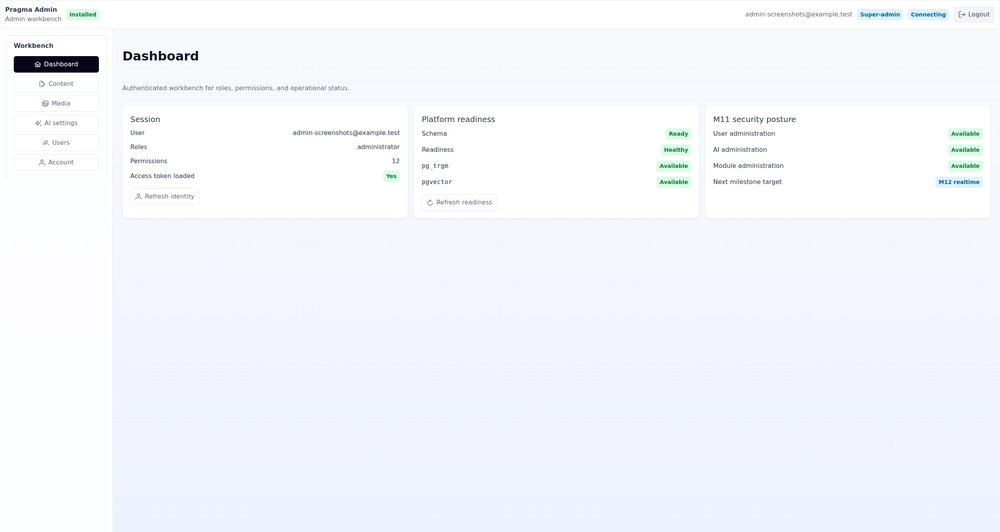
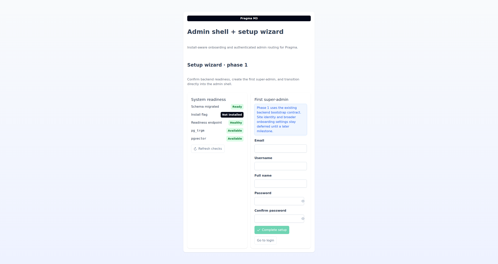
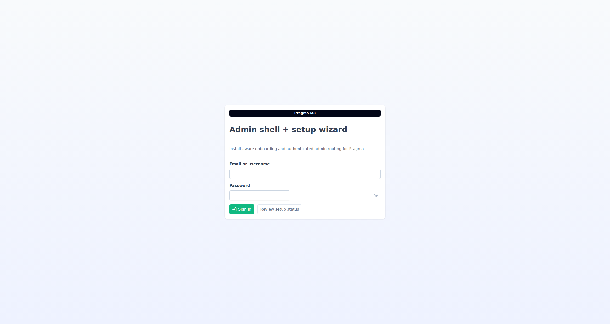
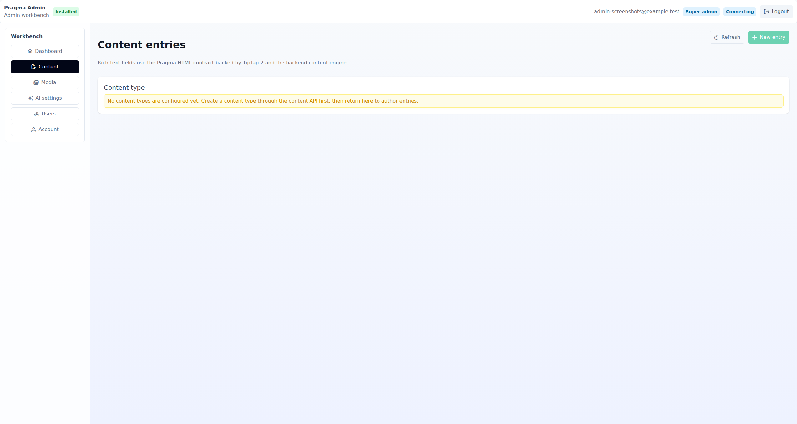
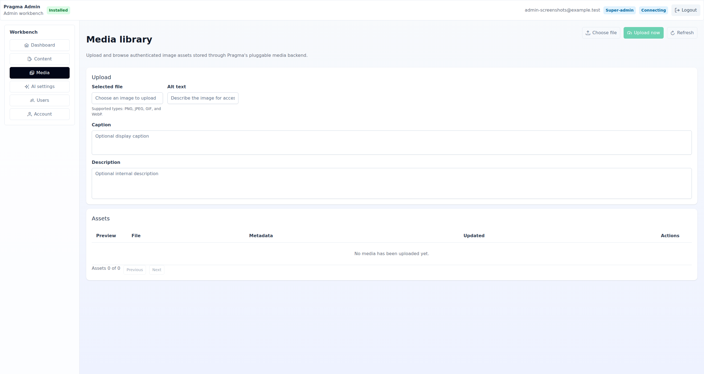
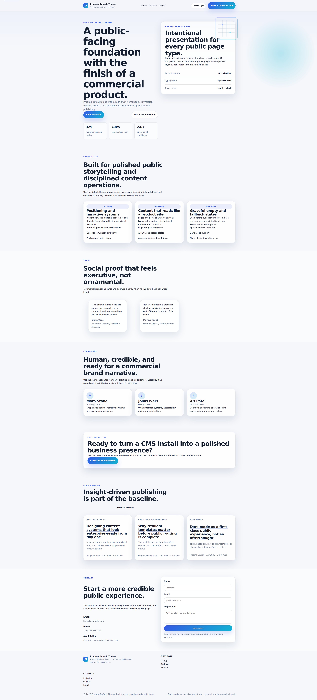
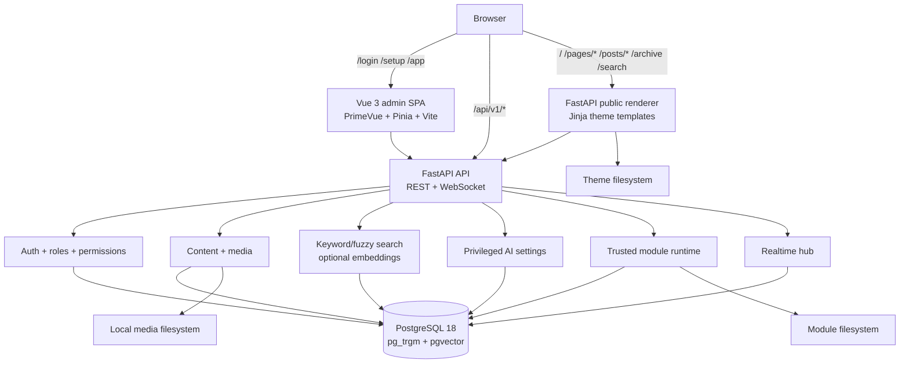
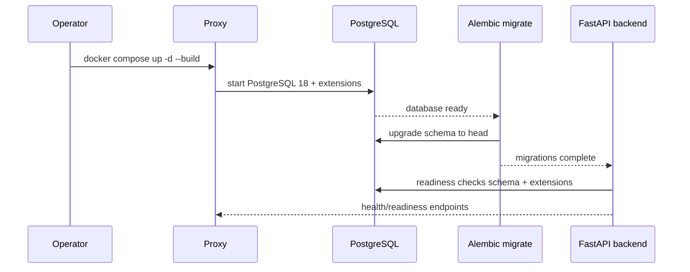
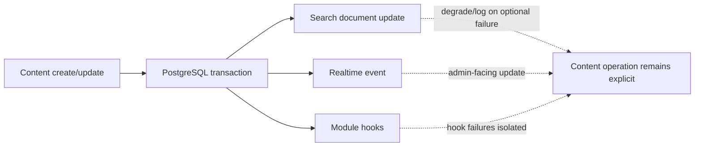
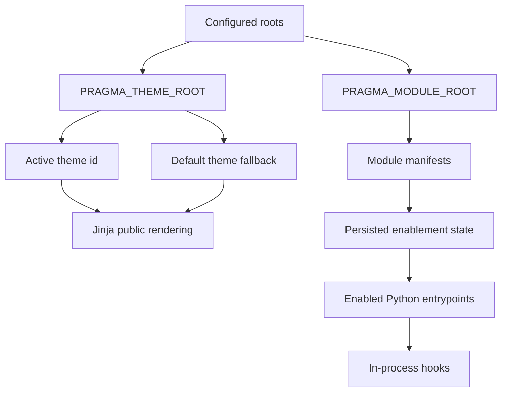

<p align="center">
  
</p>

<h1 align="center">Pragma</h1>

<p align="center">
  <strong>A PostgreSQL-native CMS with a refined Vue admin, a FastAPI core, and server-rendered public pages.</strong>
</p>

<p align="center">
  <a href="docs/installation.md"></a>
  <a href="docs/deployment.md"></a>
  <a href="backend/pyproject.toml"></a>
  <a href="admin/package.json"></a>
  <a href="docs/architecture.md"></a>
  <a href="LICENSE"></a>
</p>

<p align="center">
  <code>FastAPI</code> · <code>Vue 3</code> · <code>PrimeVue</code> · <code>PostgreSQL 18</code> · <code>pg_trgm</code> · <code>pgvector</code> · <code>Jinja themes</code> · <code>WebSockets</code>
</p>

---

## Designed for teams that want the database to be the architecture

Pragma is a **single-site, multi-user content management system** for operators who prefer explicit infrastructure over opaque platform magic. PostgreSQL is the system of record, the search engine, the realtime coordination point, and the schema contract. The backend uses raw SQL query modules instead of an ORM layer.

You get a modern administration workspace, a REST API under `/api/v1`, local image media, filesystem themes, trusted backend modules, optional semantic search, and backend-rendered public pages from the same deployment.

Pragma release copy is currently aligned to **v1.0.0-rc.1**. The backend Python package uses the PEP 440-compatible version **1.0.0rc1**, and the admin package uses the semver prerelease **1.0.0-rc.1**.

---

## Interface gallery

Real screenshots captured from a live local Pragma backend and admin session.

<table>
  <tr>
    <td width="50%"><br><strong>Setup wizard</strong></td>
    <td width="50%"><br><strong>Login</strong></td>
  </tr>
  <tr>
    <td width="50%"><br><strong>Dashboard</strong></td>
    <td width="50%"><br><strong>Content workspace</strong></td>
  </tr>
  <tr>
    <td width="50%"><br><strong>Media library</strong></td>
    <td width="50%"><br><strong>Public homepage</strong></td>
  </tr>
</table>

---

## Highlights

| Area | Current capability |
| --- | --- |
| **Admin** | Vue 3 + PrimeVue SPA with setup, login, dashboard, content, media, AI settings, users, and account routes. |
| **Backend** | Python 3.12 + FastAPI app factory, structured errors, health/readiness, install detection, REST APIs, WebSocket realtime. |
| **Database** | PostgreSQL 18 with `pg_trgm` and `vector`/pgvector as the supported database contract. |
| **Content** | Content types, entries, publishing state, rich-text validation, public pages/posts/archive/search routes. |
| **Media** | Local filesystem-backed image uploads for JPEG, PNG, GIF, and WebP. |
| **Search** | Keyword/fuzzy search with optional semantic/vector behavior when embeddings and database capabilities are available. |
| **Public frontend** | Backend-rendered Jinja theme routes using the active filesystem theme. |
| **Themes** | Filesystem discovery with a checked-in `themes/default` bundle. |
| **Modules** | Filesystem-discovered trusted Python modules with manifests, persisted enablement, and isolated hook failures. |
| **Deployment** | Production Compose stack ordered `db -> migrate -> backend -> proxy`, with media and module volumes. |

---

## Architecture









### Repository map

```text
pragma/
├── backend/          FastAPI backend, Alembic migrations, backend tests
├── admin/            Vue 3 admin SPA, Vite, Vitest specs
├── docker/           Dev DB compose, production compose, proxy, validation
├── themes/default/   Checked-in public theme templates and static assets
└── docs/             Install, deployment, architecture, configuration, testing
```

---

## Quick start: Docker-backed development database

This path starts PostgreSQL only. Run the backend and admin directly on your host.

```bash
docker compose -f docker/docker-compose.dev.yml --env-file docker/dev.env.example up -d
cp backend/.env.example backend/.env

cd backend
uv sync --dev
set -a && . ./.env && set +a
uv run alembic upgrade head
uv run uvicorn pragma.app:create_app --factory --host 127.0.0.1 --port 8000 --proxy-headers
```

In another shell:

```bash
cd admin
npm ci
VITE_BACKEND_PROXY_TARGET=http://127.0.0.1:8000 npm run dev
```

Open the admin app and complete the setup wizard. The wizard creates the first administrator; database provisioning and migrations stay operator-controlled.

Full guide: [Installation](docs/installation.md) and [Development](docs/development.md).

---

## Manual installation

Use this path when you provide PostgreSQL, process supervision, TLS, and reverse proxying yourself.

```sql
CREATE EXTENSION IF NOT EXISTS pg_trgm;
CREATE EXTENSION IF NOT EXISTS vector;
```

```bash
cp backend/.env.example backend/.env
cd backend
uv sync --dev
set -a && . ./.env && set +a
uv run alembic upgrade head
uv run uvicorn pragma.app:create_app --factory --host 127.0.0.1 --port 8000 --proxy-headers
```

```bash
cd admin
npm ci
npm run build
```

Route `/api/v1` and `/api/v1/realtime/stream` to the backend, serve admin SPA routes such as `/login`, `/setup`, and `/app/*` from `admin/dist`, and send public routes such as `/`, `/pages/*`, `/posts/*`, `/archive`, and `/search` to the backend public renderer.

More: [Installation](docs/installation.md#manual-non-docker-path) and [Deployment](docs/deployment.md#non-docker-deployment-notes).

---

## Production Docker deployment

```bash
cp docker/prod.env.example docker/prod.env
# edit docker/prod.env for credentials, JWT secret, base URL, ports, and proxy settings
docker compose -f docker/docker-compose.yml --env-file docker/prod.env up -d --build
```

Inspect and validate:

```bash
docker compose -f docker/docker-compose.yml --env-file docker/prod.env ps
docker compose -f docker/docker-compose.yml --env-file docker/prod.env logs backend proxy
./docker/validate-production.sh docker/prod.env
```

Optional smoke validation, with real secrets and available ports:

```bash
PRAGMA_VALIDATE_SMOKE=1 ./docker/validate-production.sh docker/prod.env
```

Production Docker supports raw env secrets or file-secret variants for the database password, JWT secret, and setup bootstrap secret (`PRAGMA_SETUP_SECRET_FILE`). Configure exactly one source per secret. See [Deployment](docs/deployment.md) and [Configuration](docs/configuration.md#docker-secret-file-variables).

---

## Testing and validation

```bash
(cd backend && uv run pytest -n 32 --dist loadscope tests)
```

```bash
(cd admin && npm run test)
(cd admin && npm run build)
```

For a local pre-commit-equivalent gate, run the checks directly from the repo root:

```bash
(cd backend && uv run ruff check .)
(cd backend && uv run pytest -n 32 --dist loadscope tests)
(cd admin && npm run test)
(cd admin && npm run build)
```

```bash
docker compose -f docker/docker-compose.dev.yml --env-file docker/dev.env.example config >/dev/null
PRAGMA_DATABASE_PUBLISHED_PORT=15432 \
  docker compose -f docker/docker-compose.yml --env-file docker/prod.env.example config >/dev/null
```

The backend pytest command runs through `uv` with the project xdist defaults. Run only one pytest process at a time; if a backend suite fails, follow the retry policy in [Testing](docs/testing.md#retry-policy-note). The local gate runs backend Ruff, backend pytest, admin Vitest, and the admin production build.

More: [Testing](docs/testing.md).

---

## Configuration that matters first

| Setting | Purpose |
| --- | --- |
| `PRAGMA_DATABASE_HOST`, `PRAGMA_DATABASE_PORT`, `PRAGMA_DATABASE_NAME` | PostgreSQL connection target. |
| `PRAGMA_DATABASE_USER`, `PRAGMA_DATABASE_PASSWORD` | Database credentials, unless using the documented file-secret path. |
| `PRAGMA_JWT_SECRET_KEY` | Token signing secret, unless using the documented file-secret path. |
| `PRAGMA_BASE_URL` | Canonical public/admin base URL. |
| `PRAGMA_MEDIA_ROOT` | Local media storage root. |
| `PRAGMA_THEME_ROOT`, `PRAGMA_THEME_ACTIVE_ID`, `PRAGMA_THEME_DEFAULT_ID` | Theme discovery and fallback selection. |
| `PRAGMA_MODULE_ROOT` | Trusted module root; control write access at the deployment layer. |
| `PRAGMA_SEARCH_ENABLE_SEMANTIC` | Enables semantic/vector behavior only when prerequisites are available. |
| `PRAGMA_REALTIME_ENABLED` | Enables ticketed admin WebSocket realtime. |

Keep `docker/dev.env.example` (`PRAGMA_DB_*`) separate from backend runtime settings (`PRAGMA_DATABASE_*`).

Full reference: [Configuration](docs/configuration.md).

---

## Module trust boundary

Modules are backend Python code installed by an operator under `PRAGMA_MODULE_ROOT`. When enabled, entrypoints and hooks execute inside the backend process with backend privileges. Treat write access to the module root as equivalent to permission to run backend Python code.

What Pragma does provide today:

- manifest discovery from the configured module root;
- persisted enablement state;
- permission-gated module APIs under `/api/v1/modules`;
- deterministic hook dispatch;
- logging and failure isolation so a failed hook does not crash the core operation that triggered it.

What Pragma does not provide today:

- bundled example modules;
- a graphical module lifecycle screen in the admin SPA;
- an isolation boundary for untrusted extension code.

More: [Modules and themes](docs/modules-themes.md).

---

## Current boundaries

Pragma is intentionally conservative about what it claims today:

- one site per installation;
- the development Compose file starts PostgreSQL only;
- local image media only;
- no bundled module catalog;
- no admin UI for module or theme lifecycle management;
- optional semantic search, not a required runtime dependency;
- no checked-in non-Docker process-manager or reverse-proxy unit files.

---

## Documentation index

- [Installation](docs/installation.md)
- [Development](docs/development.md)
- [Configuration](docs/configuration.md)
- [Setup wizard](docs/setup-wizard.md)
- [Testing](docs/testing.md)
- [Deployment](docs/deployment.md)
- [Architecture](docs/architecture.md)
- [Modules and themes](docs/modules-themes.md)
- [Troubleshooting](docs/troubleshooting.md)
- [Backend package README](backend/README.md)

---

<p align="center">
  <strong>Pragma keeps content operations close to PostgreSQL, the admin experience fast, and public rendering explicit.</strong>
</p>
